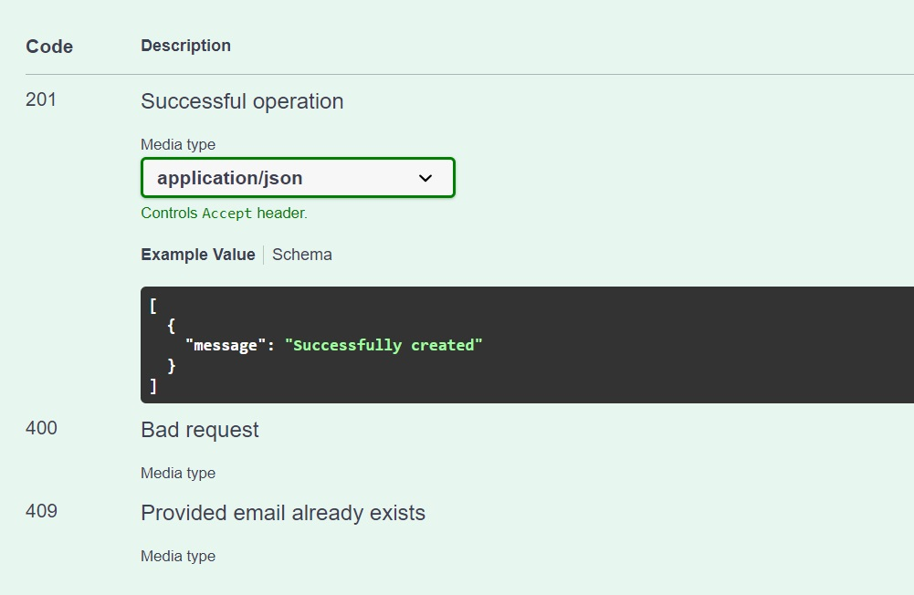
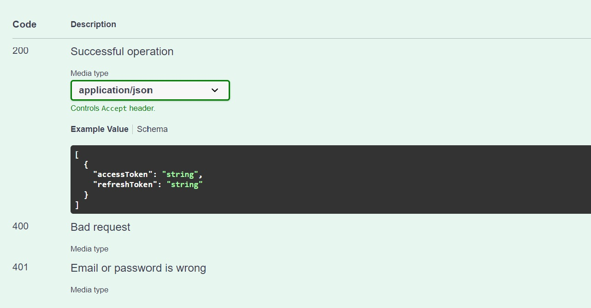
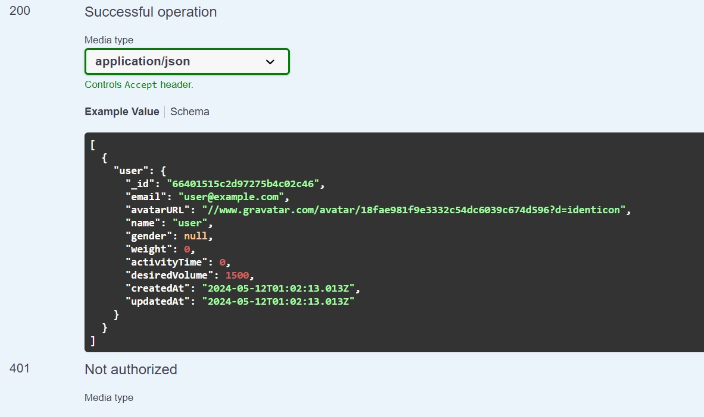
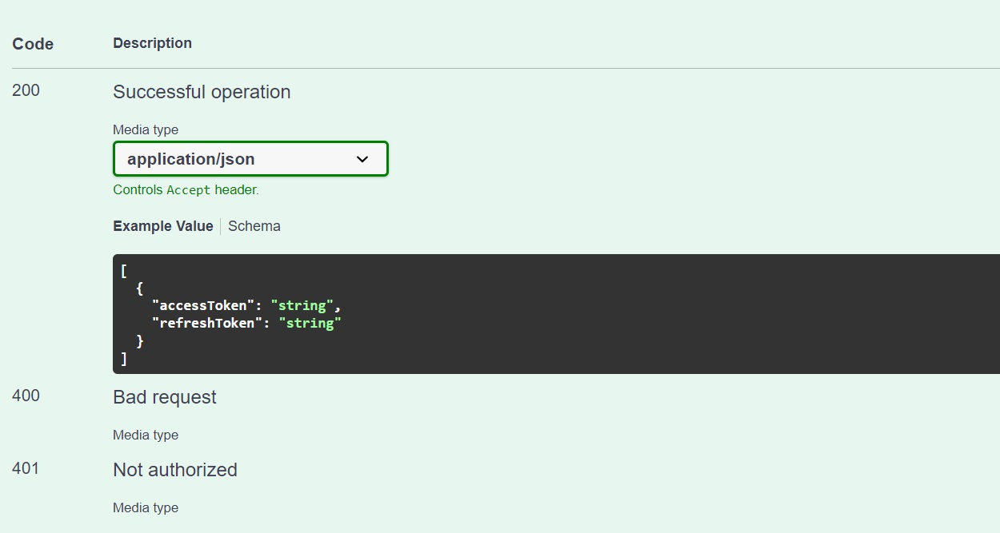
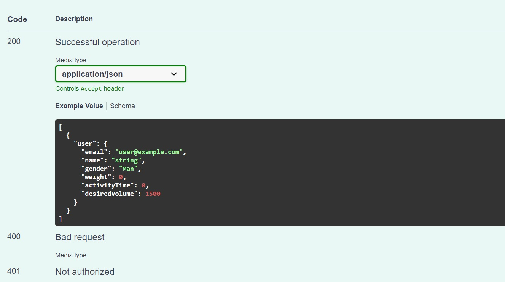
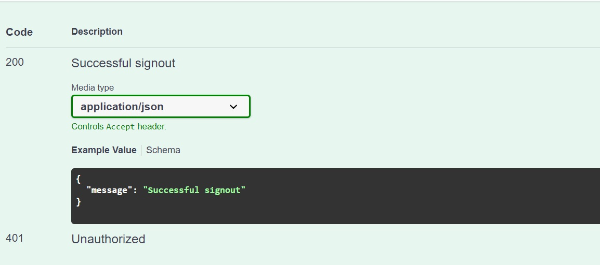
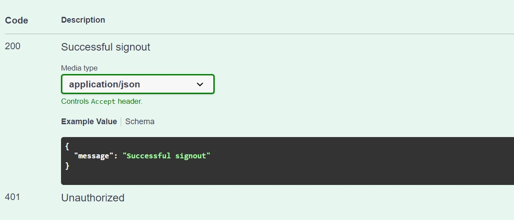
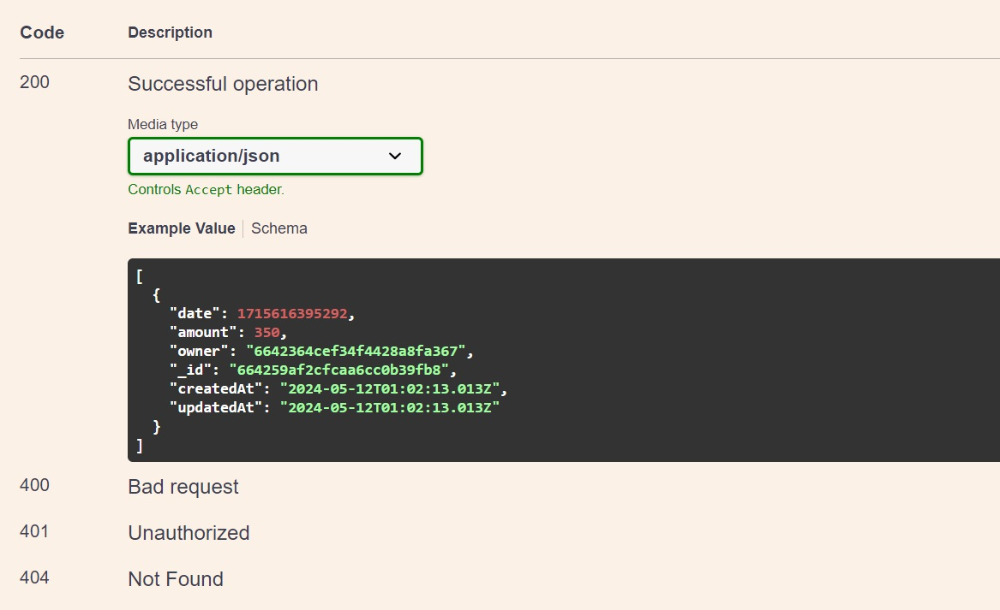
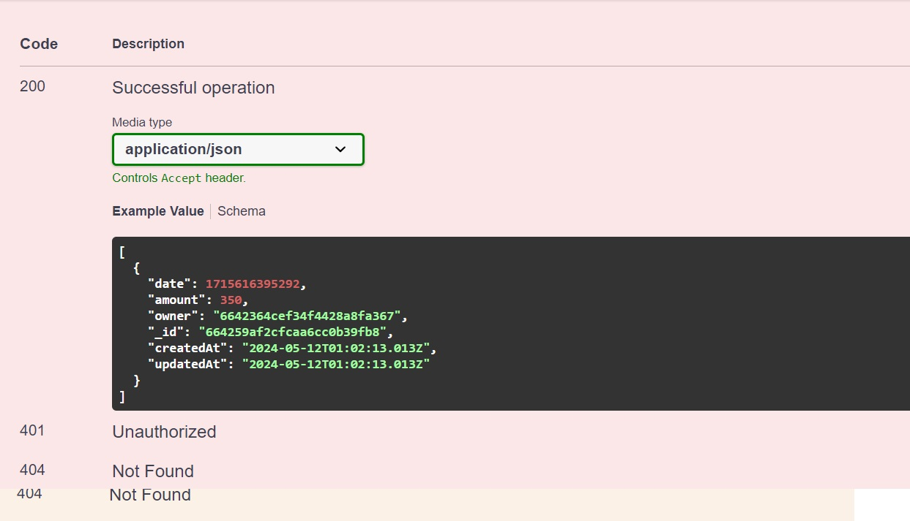
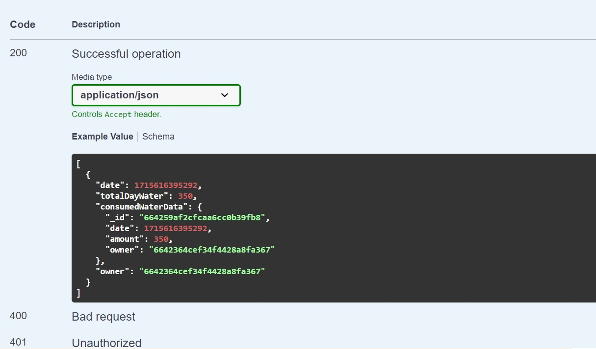

## EN

# WATER TRACKER "AQUATRACKER"

This repository contains the backend code for the Water Tracker "AQUATRACKER" application, which is designed to help users track and analyze their water consumption. The backend is built using Node.js and Express, and it provides a RESTful API for the frontend to interact with.

## Features

- User authentication
- Water consumption tracking
- Daily, weekly, and monthly statistics
- API documentation with Swagger

## Installation and Setup

1.  Clone the repository
    ```sh
    https://github.com/WAYLIIKE/server-watertrack-project-nodejs.git
    ```
2.  Install dependencies
    ```sh
    npm install
    ```
3.  Create a .env file in the backend directory and add the necessary environment variables:
    ```sh
    PORT=
    MONGO_URI=your_mongodb_connection_string
    JWT_SECRET=your_jwt_secret
    CLOUDINARY_CLOUD_NAME=your_cloudinary_cloud_name
    CLOUDINARY_API_KEY=your_cloudinary_api_key
    CLOUDINARY_API_SECRET=your_cloudinary_api_secret
    ```
4.  Launch the application
    ```sh
    npm start
    ```

## API Endpoints

### User Routes

- POST /users/signup

  - Register a new user
  - Request Body:

  ```sh
  {"email": "user@example.com",
  "password": "Qwerty123"}
  ```

  - Responses

  

- POST /users/login

  - Authenticate a user and return a token
  - Request Body

  ```sh
  {"email": "user@example.com",
  "password": "Qwerty123"}
  ```

  - Responses

  

- GET /users /current

  - Get current user object
  - Response

  

- POST/users/current/refresh

  - Refresh current user tokens
  - Request body

  ```sh
  {"refreshToken": "string"}
  ```

  - Response

  

- PATCH/users/edit

  - User edit
  - Request body

  ```sh
  {"email": "user@example.com",
  "name": "string",
  "gender": "Man",
  "weight": 600,
  "activityTime": 720,
  "desiredVolume": 5000}
  ```

  - Response

  

- POST/users/signout

  - User signout
  - Response

  

- POST/water/add

  - Water add
  - Request body

  ```sh
  {"date": 1715616395292,
  "amount": 350}
  ```

  - Response

  

- PUT/water/edit/{id}

  - Water edit by id
  - Request body

  ```sh
  {"date": 1715616395292,
  "amount": 350}
  ```

  - Response

  

- DELETE/water/remove/{id}

  - Water delete by id
  - Response

  

- GET/water/day/{date}

  - Water info by day
  - Response

  

[Link Swagger](https://server-watertrack-project-nodejs.onrender.com/api-docs/)

## Technologies Used

- Node.js: JavaScript runtime built on Chrome's V8 JavaScript engine
- Express: Fast, unopinionated, minimalist web framework for Node.js
- MongoDB: NoSQL database for storing user and water consumption data
- Mongoose: Elegant MongoDB object modeling for Node.js

- JWT: JSON Web Tokens for secure authentication

- Cloudinary: Cloud storage for user profile images
  Swagger: API documentation tool

And other....

## Contributors

Team Lead - [Valentyn Savytskyi](https://www.linkedin.com/in/wayliike/)

Developer - [Artem Skyba](https://www.linkedin.com/in/artem-skyba-a47a90275/)

Developer - [Valentyn Hromadskyi ](https://www.linkedin.com/in/valentyn-hromadskyi/)

# UA

# WATER TRACKER "AQUATRACKER"

Цей репозиторій містить бекенд код для додатку "AQUATRACKER", який допомагає користувачам відстежувати та аналізувати їхнє споживання води. Бекенд побудований на Node.js та Express, і надає RESTful API для взаємодії з фронтендом.

## Можливості

- Аутентифікація користувачів
- Відстеження споживання води
- Статистика за день, тиждень та місяць
- Документація API з використанням Swagger
- Встановлення та налаштування

## Встановлення та налаштування

1.  Клонуйте репозиторій
    ```sh
    https://github.com/WAYLIIKE/server-watertrack-project-nodejs.git
    ```
2.  Встановіть задежності
    ```sh
    npm install
    ```
3.  Створіть файл .env у директорії бекенду та додайте необхідні змінні середовища:
    ```sh
    PORT=
    MONGO_URI=your_mongodb_connection_string
    JWT_SECRET=your_jwt_secret
    CLOUDINARY_CLOUD_NAME=your_cloudinary_cloud_name
    CLOUDINARY_API_KEY=your_cloudinary_api_key
    CLOUDINARY_API_SECRET=your_cloudinary_api_secret
    ```
4.  Запустіть сервер:
    ```sh
    npm start
    ```

## Ендпоінти

- POST /users/signup

  - Реестрація нового користувача
  - Тіло запиту:

  ```sh
  {"email": "user@example.com",
  "password": "Qwerty123"}
  ```

  - Відповідь

  

- POST /users/login

  - Аутентифікація користувача та повернення токена
  - Тіло запиту

  ```sh
  {"email": "user@example.com",
  "password": "Qwerty123"}
  ```

  - Відповідь

  

- GET /users /current

  - Отримання об'єкта поточного користувача
  - Відповідь

  

- POST/users/current/refresh

  - Оновлення токенів поточного користувача
  - Тіло запиту

  ```sh
  {"refreshToken": "string"}
  ```

  - Відповідь

  

- PATCH/users/edit

  - Редагування користувача
  - Тіло запиту

  ```sh
  {"email": "user@example.com",
  "name": "string",
  "gender": "Man",
  "weight": 600,
  "activityTime": 720,
  "desiredVolume": 5000}
  ```

  - Відповідь

  

- POST/users/signout

  - Вихід користувача
  - Відповідь

  

- POST/water/add

  - Додавання води
  - Тіло запиту

  ```sh
  {"date": 1715616395292,
  "amount": 350}
  ```

  - Відповідь

  

- PUT/water/edit/{id}

  - Редагування води за id
  - Тіло запиту

  ```sh
  {"date": 1715616395292,
  "amount": 350}
  ```

  - Відповідь

  

- DELETE/water/remove/{id}

  - Видалення води за id
  - Відповідь

  

- GET/water/day/{date}

  - Ігформація про воду за день
  - Відповідь

  

[Посилання на Swagger документацію](https://server-watertrack-project-nodejs.onrender.com/api-docs/)

## Використані технології

- Node.js: середовище виконання JavaScript на основі V8
- Express: швидкий, невибагливий веб-фреймворк для Node.js
- MongoDB: NoSQL база даних для зберігання даних користувачів і споживання води
- Mongoose: об'єктно-документний маппер для MongoDB
- JWT: JSON Web Tokens для безпечної аутентифікації
- Cloudinary: хмарне сховище для зображень профілів користувачів
- Swagger: інструмент для документування API

## Команда розробників

Team Lead - [Valentyn Savytskyi](https://www.linkedin.com/in/wayliike/)

Developer - [Artem Skyba](https://www.linkedin.com/in/artem-skyba-a47a90275/)

Developer - [Valentyn Hromadskyi ](https://www.linkedin.com/in/valentyn-hromadskyi/)
